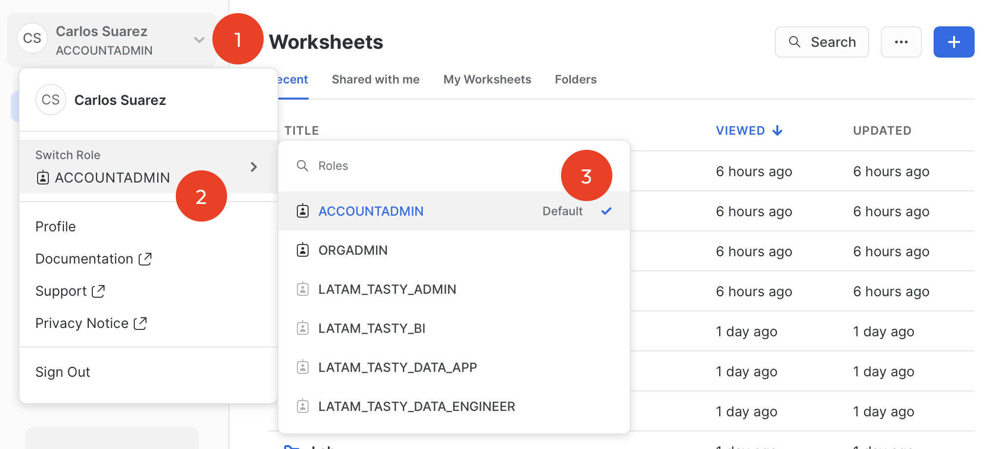
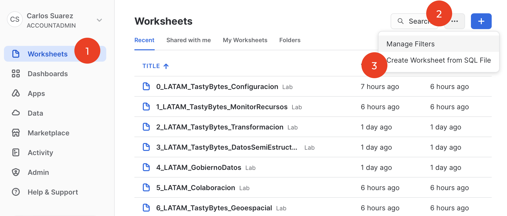
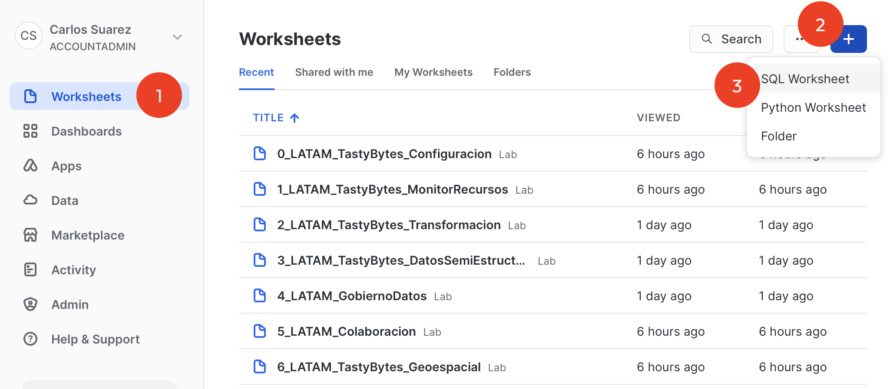
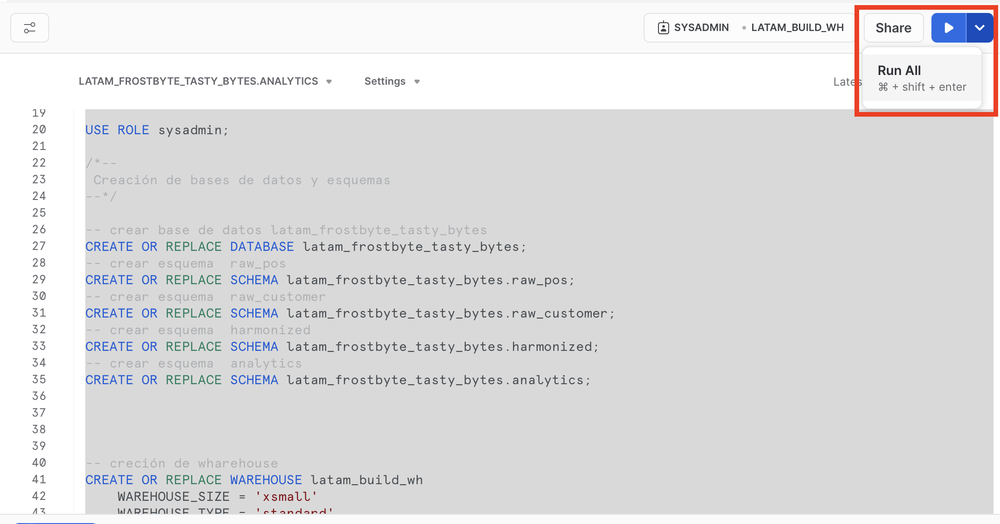

# HOL-ZeroToSnowflake-PTBR
Laboratório - Zero to Snowflake

Neste laboratório é possível implementar diferentes casos de uso em uma empresa fictícia chamada TastyBytes usando dados do Snowflake Marketplace (Clima e Geografia) bem como carregar dados de um estágio externo no AWS S3.

## O que é TastyBytes?

Uma rede global de food trucks, com diversas opções de menus regionais, presente em mais de 30 cidades em 15 países.

## Requerimentos
- Conta trial na plataforma Snowflake (https://signup.snowflake.com/) e conhecimentos básicos em SQL.

# Configuração e Carga de Dados 

Passo a passo para configuração inicial da demo (também descrito no vídeo "Configuração e Carga de Dados ") 

## Passo 1: Ativar role ACCOUNTADMIN

## Passo 2: Carregar o arquivo 0_LATAM_TastyBytes_ConfigInicial.sql
Opção 1 - Carregar dados na opção "Criar planilha a partir do arquivo SQL", uma janela de seleção do sistema operacional será aberta e escolherá onde o arquivo SQL será armazenado.

Opção 2 - Carregar dados na opção "Create SQL Worksheet", você pode abrir o arquivo SQL em um navegador, copiar e colar o código na planilha recém-criada.

## Passo 3: Executar todo código SQL (descrito com mais detalhes em video)
Selecione todo o código SQL e execute tudo de uma única vez.

# Projeto

Uma vez concluídos o passo 1 e o passo 2 da configuração, o projeto propõe 6 etapas, que vão desde a criação de alertas e cotas de uso dw warehouses (cluster de processamento), transformação dos dados, utilização de dados do tipo VARIANT para trabalhar com padrões semi-estruturados de arquivos, governança de dados por meio de tags definindo políticas para mascarar dados confidenciais e privados, bem como segmentação por linha, aplicar colaboração de dados para acessar dados do mercado Snowflake para clima e geografia.

- Governança de recursos
 1_LATAM_TastyBytes_MonitorDeRecursos.sql
- Transformação de dados
 2_LATAM_TastyBytes_Transformacao.sql
- Dados Semi-Estruturados
 3_LATAM_TastyBytes_DadosSemiEstructurados.sql
- Governança de Dados
 4_LATAM_GovernancaDados.sql
- Colaboração
 5_LATAM_Colaboracao.sql
- Geoespacial 
 6_LATAM_TastyBytes_Geoespacial.sql
